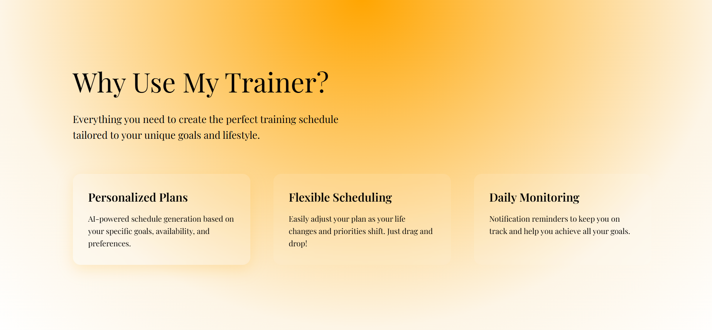
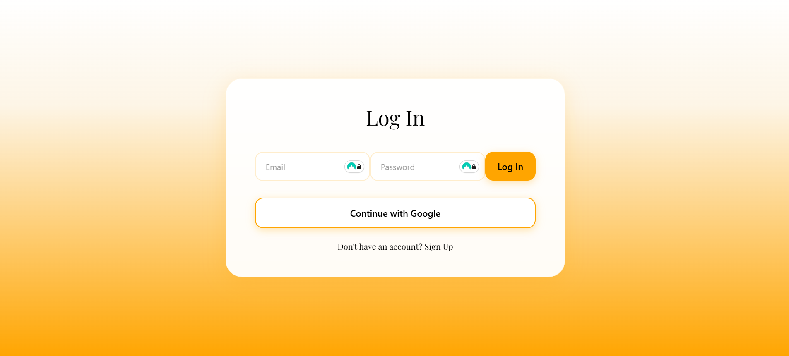
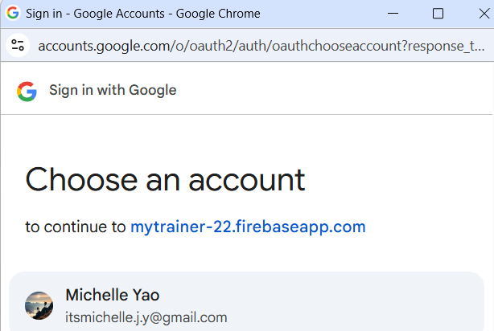
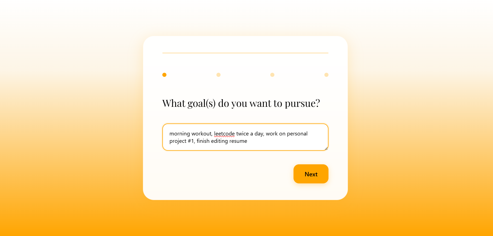
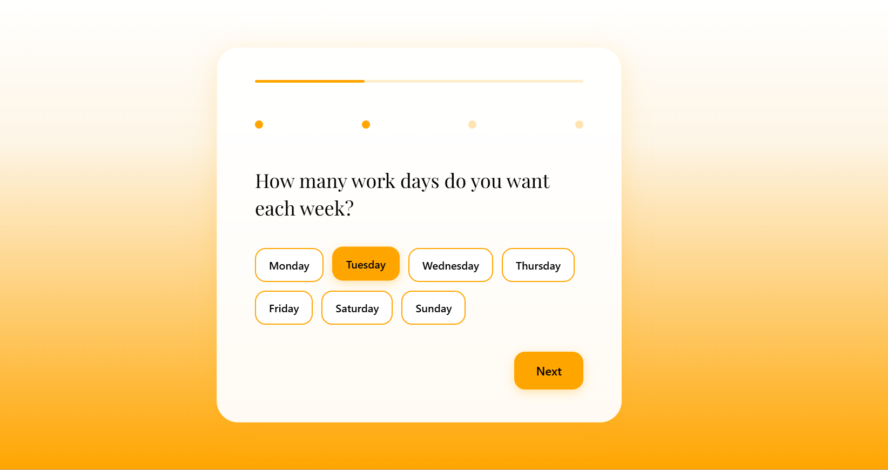
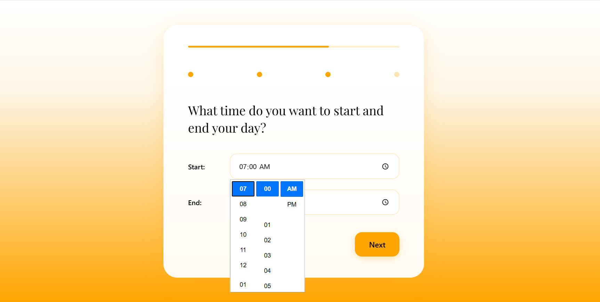
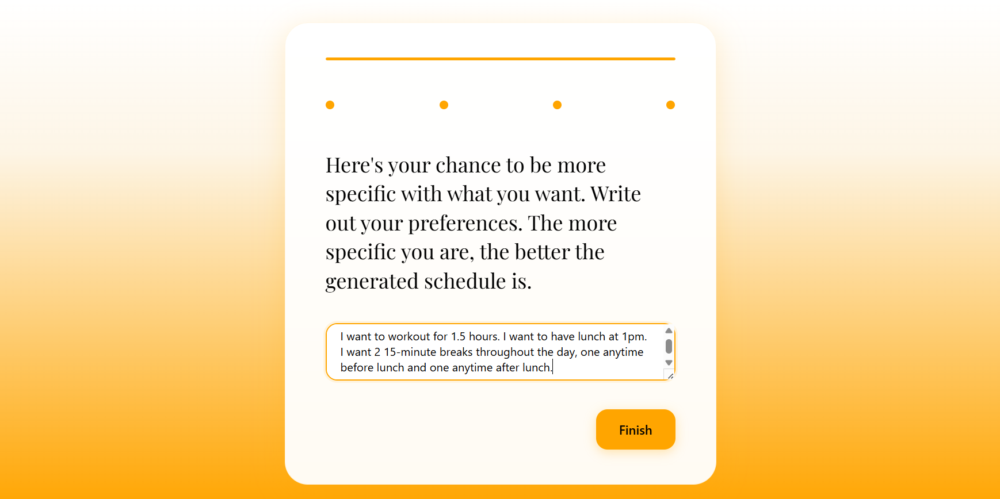
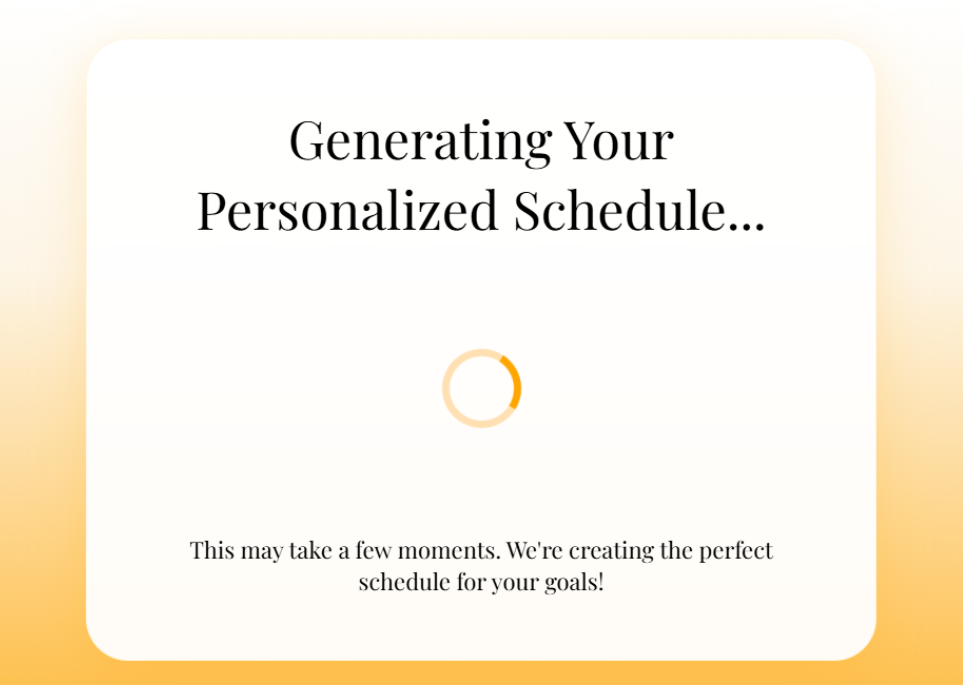
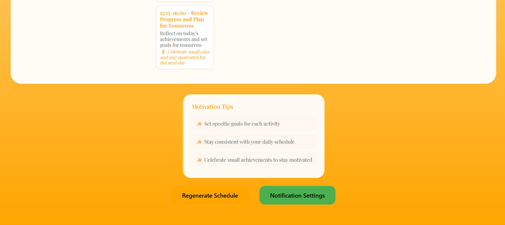

# MyTrainer - AI-Powered Personal Training Scheduler

MyTrainer is a comprehensive web application that generates personalized training schedules using AI. The app combines intelligent scheduling with automated notifications to help users achieve their fitness and lifestyle goals.

## What It Does

MyTrainer creates customized weekly schedules based on your:
- **Personal Goals**: Fitness, productivity, wellness, or any lifestyle objectives
- **Availability**: Work days, free time, and preferred activity times
- **Preferences**: Activity types, intensity levels, and scheduling preferences

The app then provides:
- **AI-Generated Schedules**: Personalized weekly plans with specific activities and times
- **Smart Notifications**: SMS and push notifications to keep you on track
- **Flexible Management**: Easy schedule adjustments and regeneration options

## App Walkthrough

### Landing Page
Start your journey with our beautiful, modern landing page that showcases the app's features and benefits.

<div align="center">
  
  
  
</div>

### Authentication
Secure login with Google authentication for a seamless user experience.

<div align="center">
  
  
</div>

### Onboarding Process
Answer a few simple questions to help us understand your goals and preferences.

<div align="center">
  
  
</div>

<div align="center">
  
  
</div>

### AI Schedule Generation
Watch as our AI creates your personalized schedule in real-time.

<div align="center">
  
</div>

### Your Personalized Schedule
View and manage your AI-generated weekly schedule with beautiful, organized layouts.

<div align="center">
  
  
</div>

<div align="center">
  
  
</div>

## Key Features

### AI-Powered Scheduling
- **Personalized Plans**: ChatGPT generates schedules tailored to your unique goals and lifestyle
- **Smart Adaptation**: AI considers your work schedule, preferences, and available time
- **Motivation Tips**: AI provides personalized tips to help you stay motivated
- **Regeneration**: Easily regenerate your schedule if you want changes

### Smart Notifications
- **Activity Reminders**: Notifications 5 minutes before each scheduled activity
- **Daily Motivation**: Morning motivation messages to start your day right
- **Evening Reflection**: Evening prompts for progress reflection
- **Multiple Channels**: SMS notifications via Twilio and push notifications via Firebase
- **Customizable**: Choose which notification types you want to receive

### Pretty Interface
- **Modern Design**: Clean, elegant interface with smooth animations
- **Responsive**: Works perfectly on desktop, tablet, and mobile devices
- **Intuitive**: Easy-to-use onboarding and schedule management
- **Visual Feedback**: Beautiful schedule display with pastel colors

## Quick Start

### Prerequisites
- Node.js (v14 or higher)
- OpenAI API key
- Twilio account (for SMS notifications)
- Firebase project (for push notifications)

### Installation

1. **Clone the repository**
   ```bash
   git clone <repository-url>
   cd mytrainer
   ```

2. **Install dependencies**
   ```bash
   npm install
   cd server && npm install && cd ..
   ```

3. **Set up environment variables**
   Create a `.env` file in the project root:
   ```env
   # OpenAI API
   REACT_APP_OPENAI_API_KEY=your_openai_api_key_here
   
   # Twilio (SMS notifications)
   TWILIO_ACCOUNT_SID=your_twilio_account_sid
   TWILIO_AUTH_TOKEN=your_twilio_auth_token
   TWILIO_PHONE_NUMBER=+1234567890
   
   # Firebase (Push notifications)
   REACT_APP_FIREBASE_API_KEY=your_firebase_api_key
   REACT_APP_FIREBASE_AUTH_DOMAIN=your-project.firebaseapp.com
   REACT_APP_FIREBASE_PROJECT_ID=your-project-id
   REACT_APP_FIREBASE_STORAGE_BUCKET=your-project.appspot.com
   REACT_APP_FIREBASE_MESSAGING_SENDER_ID=123456789
   REACT_APP_FIREBASE_APP_ID=your-app-id
   REACT_APP_FIREBASE_VAPID_KEY=your_vapid_key_here
   ```

4. **Start the servers**
   ```bash
   # Start the notification server (in one terminal)
   cd server && node notificationServer.js
   
   # Start the React app (in another terminal)
   npm start
   ```

5. **Open the application**
   Visit `http://localhost:3000` in your browser

## Detailed Setup

### OpenAI API Setup
1. Go to [OpenAI Platform](https://platform.openai.com/)
2. Sign up or log in to your account
3. Navigate to "API Keys" in your dashboard
4. Create a new API key
5. Add the key to your `.env` file

### Twilio Setup (SMS Notifications)
1. Create a [Twilio account](https://console.twilio.com/)
2. Get your Account SID and Auth Token from the dashboard
3. Purchase a phone number for SMS capabilities
4. Add credentials to your `.env` file

### Firebase Setup (Push Notifications)
1. Create a [Firebase project](https://console.firebase.google.com/)
2. Enable Cloud Messaging in project settings
3. Generate a VAPID key pair
4. Download the service account JSON file
5. Save it as `server/firebase-service-account.json`
6. Add Firebase configuration to your `.env` file

## How to Use

### 1. Onboarding
- Enter your personal goals and objectives
- Specify your work days and available time
- Choose your preferred activity types and intensity levels

### 2. Schedule Generation
- The AI automatically creates your personalized weekly schedule
- Review the generated activities and times
- Regenerate if you want changes

### 3. Notification Setup
- Click "Notification Settings" in your schedule
- Enable desired notification types (SMS, push, or both)
- Enter your phone number for SMS notifications
- Grant browser permissions for push notifications

### 4. Daily Use
- Receive notifications before each scheduled activity
- Get morning motivation messages
- Reflect on your progress in the evening
- Adjust your schedule as needed

## Architecture

### Frontend (React)
- `src/App.js` - Main application component
- `src/Onboarding.js` - User onboarding and data collection
- `src/ScheduleDisplay.js` - Schedule display and management
- `src/NotificationSettings.js` - Notification configuration
- `src/scheduleService.js` - OpenAI API integration
- `src/notificationService.js` - Frontend notification logic

### Backend (Node.js)
- `server/notificationServer.js` - Notification scheduling and sending
- Handles SMS via Twilio
- Manages push notifications via Firebase
- Schedules automated notifications

### Key Technologies
- **Frontend**: React, CSS3, HTML5
- **Backend**: Node.js, Express
- **AI**: OpenAI GPT API
- **SMS**: Twilio
- **Push Notifications**: Firebase Cloud Messaging
- **Styling**: Custom CSS with gradients and animations

## Security & Privacy

- **Environment Variables**: Never commit `.env` files to version control
- **API Keys**: Keep all API keys secure and private
- **User Data**: User information is processed securely
- **Notifications**: User consent required before sending notifications
- **Rate Limiting**: Implemented to prevent abuse

## Cost Considerations

### OpenAI API
- Each schedule generation typically costs a few cents
- Monitor usage in your OpenAI dashboard
- Costs based on the number of tokens used

### Twilio SMS
- Free tier: 1,000 SMS/month
- Paid: ~$0.0075 per SMS (varies by country)
- Consider user opt-in rates and frequency

### Firebase
- Free tier: 1 million FCM messages/month
- Paid: $0.50 per million messages
- Very cost-effective for push notifications

## Troubleshooting

### Common Issues

**API Key Problems**
- Verify your `.env` file is in the project root
- Check that API keys are correct and active
- Restart the development server after adding keys

**Notification Issues**
- Verify Twilio credentials and phone number format
- Check Firebase configuration and VAPID key
- Ensure browser permissions are granted
- Check server logs for error messages

**Server Connection**
- Verify notification server is running on port 3001
- Check CORS configuration
- Ensure all environment variables are set